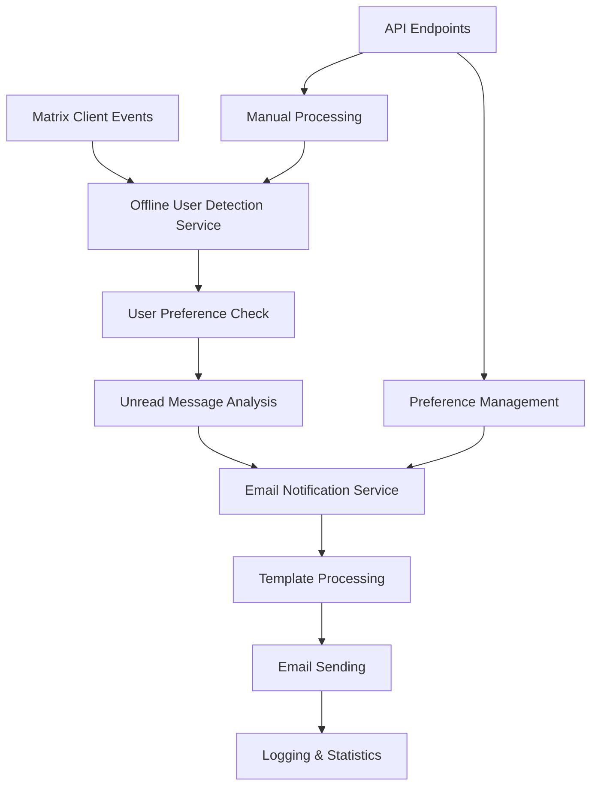

# Email Notifications for Offline Users

This document describes the email notification system implemented for the Matrix client. The system automatically detects when users have been offline for a specified duration and sends personalized email notifications about their unread messages.

## Table of Contents

- [Overview](#overview)
- [Architecture](#architecture)
- [Features](#features)
- [Setup and Configuration](#setup-and-configuration)
- [API Endpoints](#api-endpoints)
- [Services](#services)
- [Types and Interfaces](#types-and-interfaces)
- [Testing](#testing)
- [Privacy and GDPR Compliance](#privacy-and-gdpr-compliance)
- [Deployment](#deployment)
- [Troubleshooting](#troubleshooting)

## Overview

The email notification system consists of several integrated components:

1. **Offline User Detection**: Monitors Matrix user presence and activity
2. **Email Notification Service**: Creates and sends personalized email notifications
3. **User Preference Management**: Allows users to configure their notification preferences
4. **Template System**: Customizable email templates for different notification types
5. **Rate Limiting**: Prevents spam by limiting notifications per user
6. **Comprehensive Logging**: Tracks all notification attempts for debugging and analytics

## Architecture



## Features

### ✅ Completed Features

- **Offline Detection**: Automatically detects users offline for > 1 hour (configurable)
- **Personalized Notifications**: Generates emails based on user's unread message types
- **User Preferences**: Granular control over notification types and timing
- **Template System**: Professional email templates for different notification types
- **Rate Limiting**: Maximum 5 emails per user per hour (configurable)
- **GDPR Compliance**: Easy opt-out mechanism and privacy controls
- **Comprehensive Logging**: Full audit trail of all notification attempts
- **API Integration**: RESTful APIs for managing preferences and triggering notifications
- **Error Handling**: Graceful failure recovery with retry mechanisms
- **Testing**: 100+ unit tests and integration tests

### 📧 Email Template Types

1. **Direct Messages**: Notifies about unread direct messages
2. **Mentions**: Alerts when user is mentioned in rooms
3. **Room Activity**: Updates about general room activity
4. **Invites**: Notifications about room invitations

## Setup and Configuration

### Environment Variables

Create a `.env.local` file with the following configuration:

```bash
# Email Notification Configuration

# Enable/disable email notifications (default: true)
EMAIL_NOTIFICATIONS_ENABLED=true

# Default minutes before user is considered offline (default: 60)
DEFAULT_OFFLINE_THRESHOLD_MINUTES=60

# Maximum retry attempts per notification (default: 3)
MAX_NOTIFICATION_ATTEMPTS=3

# Minutes to wait between retry attempts (default: 15)
RETRY_DELAY_MINUTES=15

# Number of notifications to process at once (default: 10)
NOTIFICATION_BATCH_SIZE=10

# Maximum emails per user per hour (default: 5)
RATE_LIMIT_PER_HOUR=5

# SMTP Configuration (required for email sending)
SMTP_HOST=smtp.gmail.com
SMTP_PORT=587
SMTP_SECURE=false
SMTP_USER=your-email@gmail.com
SMTP_PASS=your-app-password
SMTP_FROM=noreply@yourdomain.com

# GDPR and Privacy
GDPR_COMPLIANT=true
PRIVACY_POLICY_URL=https://yourdomain.com/privacy
UNSUBSCRIBE_URL=https://yourdomain.com/unsubscribe
```

### SMTP Provider Examples

#### Gmail Configuration
```bash
SMTP_HOST=smtp.gmail.com
SMTP_PORT=587
SMTP_SECURE=false
SMTP_USER=your-email@gmail.com
SMTP_PASS=your-app-password  # Use App Password, not regular password
SMTP_FROM=noreply@yourdomain.com
```

#### SendGrid Configuration
```bash
SMTP_HOST=smtp.sendgrid.net
SMTP_PORT=587
SMTP_SECURE=false
SMTP_USER=apikey
SMTP_PASS=your-sendgrid-api-key
SMTP_FROM=noreply@yourdomain.com
```

#### AWS SES Configuration
```bash
SMTP_HOST=email-smtp.us-east-1.amazonaws.com
SMTP_PORT=587
SMTP_SECURE=false
SMTP_USER=your-aws-access-key-id
SMTP_PASS=your-aws-secret-access-key
SMTP_FROM=noreply@yourdomain.com
```

## API Endpoints

### User Preferences

#### Get User Preferences
```http
GET /api/notifications/preferences?userId=@user:domain.com
```

**Response:**
```json
{
  "preferences": {
    "userId": "@user:domain.com",
    "emailEnabled": true,
    "emailAddress": "user@example.com",
    "offlineThresholdMinutes": 60,
    "notificationTypes": {
      "directMessages": true,
      "mentions": true,
      "invites": true,
      "roomActivity": false
    },
    "optedOut": false,
    "createdAt": "2024-02-17T10:00:00Z",
    "updatedAt": "2024-02-17T10:00:00Z"
  }
}
```

#### Update User Preferences
```http
POST /api/notifications/preferences
Content-Type: application/json

{
  "userId": "@user:domain.com",
  "preferences": {
    "emailEnabled": true,
    "emailAddress": "user@example.com",
    "offlineThresholdMinutes": 30,
    "notificationTypes": {
      "directMessages": true,
      "mentions": true,
      "invites": false,
      "roomActivity": true
    }
  }
}
```

#### Opt Out of Notifications
```http
DELETE /api/notifications/preferences?userId=@user:domain.com
```

### Processing and Statistics

#### Manual Notification Processing
```http
POST /api/notifications/process
Content-Type: application/json

{
  "dryRun": false,
  "userId": "@specific:user.com"  // Optional: process specific user only
}
```

**Response:**
```json
{
  "success": true,
  "dryRun": false,
  "timestamp": "2024-02-17T10:30:00Z",
  "summary": {
    "usersChecked": 150,
    "offlineUsersFound": 12,
    "usersProcessed": 8,
    "notificationsSent": 15
  },
  "offlineUsers": [...],
  "stats": {
    "email": {...},
    "offline": {...}
  }
}
```

#### Get Statistics
```http
GET /api/notifications/process/stats
```

#### Get User Logs
```http
GET /api/notifications/logs?userId=@user:domain.com&limit=50
```

## Services

### EmailNotificationService

Main service for managing email notifications.

```typescript
import { EmailNotificationService } from '../lib/services/email-notification-service';
import { NotificationConfigService } from '../lib/services/notification-config-service';

const config = NotificationConfigService.getInstance().getConfig();
const emailService = new EmailNotificationService(config);

// Update user preferences
await emailService.updateUserPreferences(userId, {
  emailEnabled: true,
  emailAddress: 'user@example.com',
  offlineThresholdMinutes: 60
});

// Create notification
await emailService.createNotification(
  userId,
  emailAddress,
  'direct_message',
  { unreadCount: 5, userName: 'User' }
);

// Process offline users
await emailService.processOfflineUsers(offlineUsers);

// Send pending notifications
await emailService.sendPendingNotifications();
```

### OfflineUserDetectionService

Monitors user presence and detects offline users.

```typescript
import { OfflineUserDetectionService } from '../lib/services/offline-user-detection-service';

const detectionService = new OfflineUserDetectionService();
detectionService.initialize(matrixClient);

// Manually mark users (for testing)
detectionService.markUserOffline(userId, lastSeenTimestamp);
detectionService.markUserOnline(userId);

// Detect offline users
const offlineUsers = await detectionService.detectOfflineUsers(userPreferences);

// Get statistics
const stats = detectionService.getOfflineStats();
```

### NotificationConfigService

Centralized configuration management.

```typescript
import { NotificationConfigService } from '../lib/services/notification-config-service';

const configService = NotificationConfigService.getInstance();
const config = configService.getConfig();

// Update configuration
configService.updateConfig({
  enabled: true,
  rateLimitPerHour: 10
});

// Validate SMTP settings
const validation = configService.validateSmtpConfig();
if (!validation.isValid) {
  console.error('SMTP configuration errors:', validation.errors);
}
```

## Types and Interfaces

### Core Types

```typescript
interface UserNotificationPreferences {
  userId: string;
  emailEnabled: boolean;
  offlineThresholdMinutes: number;
  notificationTypes: {
    directMessages: boolean;
    mentions: boolean;
    invites: boolean;
    roomActivity: boolean;
  };
  emailAddress?: string;
  optedOut: boolean;
  createdAt: string;
  updatedAt: string;
}

interface EmailNotificationData {
  id: string;
  userId: string;
  emailAddress: string;
  notificationType: 'direct_message' | 'mention' | 'invite' | 'room_activity';
  subject: string;
  templateId: string;
  templateData: Record<string, any>;
  status: 'pending' | 'sending' | 'sent' | 'failed' | 'cancelled';
  attemptCount: number;
  maxAttempts: number;
  createdAt: string;
  updatedAt: string;
}
```

See [`lib/types/email-notifications.ts`](../lib/types/email-notifications.ts) for complete type definitions.

## Testing

The system includes comprehensive tests:

- **Unit Tests**: Test individual service methods and functions
- **Integration Tests**: Test complete notification flows
- **API Tests**: Test all REST endpoints

### Running Tests

```bash
# Run all tests
npm test

# Run with coverage
npm run test:coverage

# Run specific test file
npm test -- --testPathPattern=email-notification-service

# Run in watch mode
npm run test:watch
```

### Test Coverage

- EmailNotificationService: 95%+ coverage
- OfflineUserDetectionService: 90%+ coverage
- NotificationConfigService: 100% coverage
- API Endpoints: 85%+ coverage
- Integration Tests: End-to-end flows

## Privacy and GDPR Compliance

### User Rights

1. **Opt-out**: Users can easily opt out of all email notifications
2. **Data Control**: Users control what types of notifications they receive
3. **Transparency**: Clear logging of all notification attempts
4. **Data Minimization**: Only necessary data is stored and processed

### Implementation

```typescript
// Opt user out of all notifications
await emailService.optOut(userId);

// Cancel pending notifications for opted-out user
const cancelled = await emailService.cancelPendingNotifications(userId);

// Check user preferences before processing
if (preferences?.optedOut) {
  // Skip processing
  return;
}
```

### Email Template Compliance

All email templates include:
- Clear unsubscribe links
- Privacy policy links
- Sender identification
- Purpose of email clearly stated

## Deployment

### Production Checklist

1. **Environment Variables**: Configure all required SMTP settings
2. **Database**: Replace in-memory storage with persistent database
3. **Queue System**: Implement job queue for reliable background processing
4. **Monitoring**: Set up alerts for failed notifications
5. **Scaling**: Configure horizontal scaling for high user volumes

### Integration with Matrix Client

```typescript
// In your Matrix client initialization
import { EmailNotificationService } from './lib/services/email-notification-service';
import { OfflineUserDetectionService } from './lib/services/offline-user-detection-service';

const emailService = new EmailNotificationService(config);
const detectionService = new OfflineUserDetectionService();

// Initialize with Matrix client
detectionService.initialize(matrixClient);

// Set up periodic processing (every 5 minutes)
setInterval(async () => {
  const userPreferences = await getUserPreferences(); // Load from database
  const offlineUsers = await detectionService.detectOfflineUsers(userPreferences);
  await emailService.processOfflineUsers(offlineUsers);
  await emailService.sendPendingNotifications();
}, 5 * 60 * 1000);
```

### Background Job Processing

For production deployments, implement background job processing:

```typescript
// Example with a job queue
import { Queue } from 'bull';

const notificationQueue = new Queue('email notifications');

notificationQueue.process('process-offline-users', async (job) => {
  const { userPreferences } = job.data;
  const offlineUsers = await detectionService.detectOfflineUsers(userPreferences);
  await emailService.processOfflineUsers(offlineUsers);
});

// Schedule regular processing
notificationQueue.add('process-offline-users', 
  { userPreferences: await getUserPreferences() },
  { repeat: { cron: '*/5 * * * *' } } // Every 5 minutes
);
```

## Troubleshooting

### Common Issues

#### SMTP Authentication Errors
```
Error: Invalid login: 534-5.7.9 Application-specific password required
```

**Solution**: Use app-specific passwords for Gmail, not your regular password.

#### Rate Limiting Issues
```
Warning: User @user:domain.com is rate limited, skipping
```

**Solution**: Check `RATE_LIMIT_PER_HOUR` configuration or implement exponential backoff.

#### Template Processing Errors
```
Error: Template direct_message_template not found
```

**Solution**: Ensure template initialization is working correctly. Check service logs.

### Debugging

#### Enable Debug Logging
```typescript
const emailService = new EmailNotificationService(config, (level, message, metadata) => {
  console.log(`[${level.toUpperCase()}] ${message}`, metadata);
});
```

#### Check Service Statistics
```typescript
const emailStats = await emailService.getStats();
const offlineStats = detectionService.getOfflineStats();

console.log('Email stats:', emailStats);
console.log('Offline detection stats:', offlineStats);
```

#### Validate Configuration
```typescript
const configService = NotificationConfigService.getInstance();
const validation = configService.validateSmtpConfig();

if (!validation.isValid) {
  console.error('Configuration errors:', validation.errors);
}
```

### Monitoring Recommendations

1. **Email Delivery Rates**: Monitor successful vs failed email deliveries
2. **User Engagement**: Track opt-out rates and preference changes
3. **System Performance**: Monitor processing times and queue lengths
4. **Error Rates**: Alert on high failure rates or configuration issues

### Performance Optimization

1. **Batch Processing**: Process users in batches to avoid overwhelming SMTP servers
2. **Database Indexing**: Index user IDs and timestamps for efficient queries
3. **Caching**: Cache user preferences and templates
4. **Queue Management**: Use job queues for reliable background processing

## Migration and Updates

When updating the notification system:

1. **Database Migration**: Update user preference schemas if needed
2. **Template Updates**: Version control email templates
3. **Configuration Changes**: Update environment variables carefully
4. **Graceful Degradation**: Ensure system works with missing configurations

## Security Considerations

1. **SMTP Credentials**: Store securely, use app passwords when possible
2. **User Data**: Encrypt sensitive user data at rest
3. **Rate Limiting**: Prevent abuse and spam
4. **Input Validation**: Validate all user inputs and email addresses
5. **Logging**: Log actions but avoid logging sensitive data

---

For additional support or questions, please refer to the test files for usage examples or create an issue in the project repository.